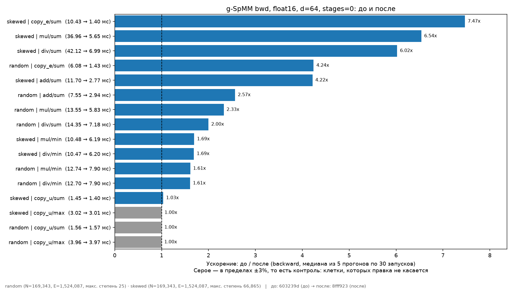
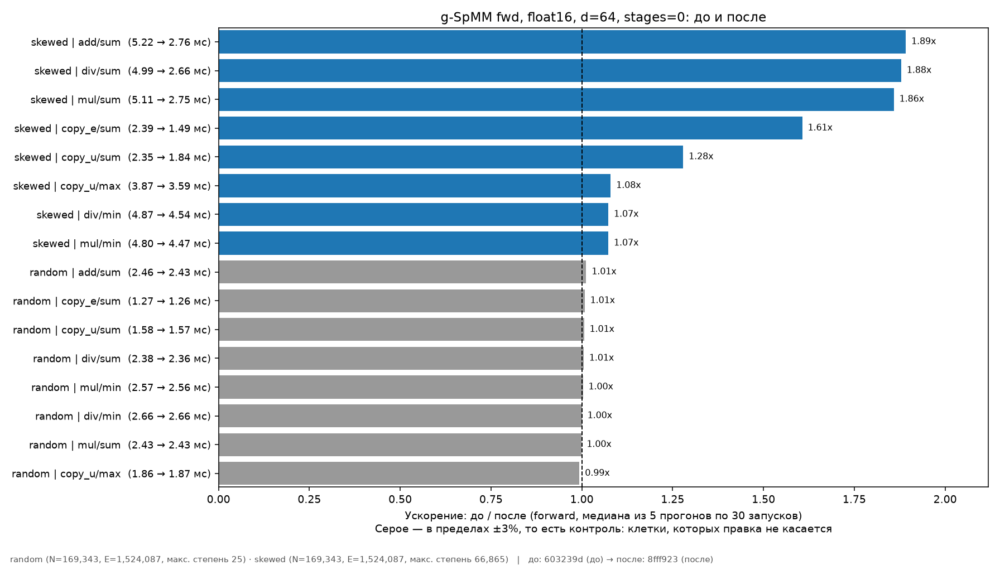

# g-SpMM: turbo_gnn против DGL

Tesla T4, d=64, медиана из 7 прогонов по 30 запусков, CUDA events на обеих сторонах.
`ogbn-arxiv` (N=169 343, E=1 335 586) и `random` (N=200 000, E=3 400 000).
turbo — через `turbo_gnn.gspmm`, DGL — через `dgl.ops.*`, обе стороны на побитово
одинаковых данных. Прогон и методика: [gspmm_vs_dgl/](gspmm_vs_dgl/).

В скобках — сколько клеток из 18×графов оказались быстрее у DGL.

## fp32, без пайплайнинга

| kind | geomean | медиана | мин | проигр. | картинка | данные |
|---|---|---|---|---|---|---|
| forward | **1.89x** | 1.92x | 1.10x | 0/36 | [fp32_forward.png](fp32_forward.png) | [arxiv](gspmm_vs_dgl/results/results_ogbn-arxiv_float32_bwd.json) · [random](gspmm_vs_dgl/results/results_random_float32_bwd.json) |
| **backward** | **1.31x** | 1.18x | 0.44x | 5/36 | [fp32_backward.png](fp32_backward.png) | те же |
| fwd+bwd | 1.52x | 1.48x | 0.64x | 2/36 | [fp32_fwd_bwd.png](fp32_fwd_bwd.png) | те же |

## fp16, без пайплайнинга

| kind | geomean | медиана | мин | проигр. | картинка | данные |
|---|---|---|---|---|---|---|
| forward | **2.00x** | 2.07x | 1.12x | 0/36 | [fp16_forward.png](fp16_forward.png) | [arxiv](gspmm_vs_dgl/results/results_ogbn-arxiv_float16_bwd.json) · [random](gspmm_vs_dgl/results/results_random_float16_bwd.json) |
| **backward** | **0.68x** | 0.68x | 0.32x | 30/36 | [fp16_backward.png](fp16_backward.png) | те же |
| fwd+bwd | 0.99x | 0.98x | 0.48x | 21/36 | [fp16_fwd_bwd.png](fp16_fwd_bwd.png) | те же |

## fp32, pipeline_stages=2

Три графа вместо двух — `skewed` попал бонусом от прогона, который ушёл не на те
графы. Со stages=0 напрямую не сравнивается.

| kind | geomean | медиана | мин | проигр. | картинка | данные |
|---|---|---|---|---|---|---|
| forward | 1.97x | 2.09x | 0.71x | 5/54 | [fp32_stages2_forward.png](fp32_stages2_forward.png) | [arxiv](gspmm_vs_dgl/results/results_ogbn-arxiv_float32_bwd_st2.json) · [random](gspmm_vs_dgl/results/results_random_float32_bwd_st2.json) · [skewed](gspmm_vs_dgl/results/results_skewed_float32_bwd_st2.json) |
| backward | 1.18x | 1.14x | 0.24x | 14/54 | [fp32_stages2_backward.png](fp32_stages2_backward.png) | те же |
| fwd+bwd | 1.53x | 1.55x | 0.54x | 8/54 | [fp32_stages2_fwd_bwd.png](fp32_stages2_fwd_bwd.png) | те же |

## fp16, pipeline_stages=2

| kind | geomean | медиана | мин | проигр. | картинка | данные |
|---|---|---|---|---|---|---|
| forward | **1.57x** | 1.72x | 0.67x | 5/36 | [fp16_stages2_forward.png](fp16_stages2_forward.png) | [arxiv](gspmm_vs_dgl/results/results_ogbn-arxiv_float16_bwd_st2.json) · [random](gspmm_vs_dgl/results/results_random_float16_bwd_st2.json) |
| backward | 0.65x | 0.67x | 0.31x | 32/36 | [fp16_stages2_backward.png](fp16_stages2_backward.png) | те же |
| fwd+bwd | 0.91x | 0.93x | 0.45x | 24/36 | [fp16_stages2_fwd_bwd.png](fp16_stages2_fwd_bwd.png) | те же |

## Отдельный свип по пайплайнингу

fp32 forward, три графа, только turbo меняется. Данные:
[stages{0,1,2,4}.json](gspmm_vs_dgl/results/stages/) ·
[pipeline_stages.json](gspmm_vs_dgl/results/pipeline_stages.json).

| stages | geomean | проигр. | картинка |
|---|---|---|---|
| 0 | **2.15x** | 1/54 | [fp32_forward_stages0.png](fp32_forward_stages0.png) |
| 1 | 2.06x | 1/54 | [fp32_forward_stages1.png](fp32_forward_stages1.png) |
| 2 | 1.96x | 5/54 | [fp32_forward_stages2.png](fp32_forward_stages2.png) |
| 4 | 1.96x | 4/54 | [fp32_forward_stages4.png](fp32_forward_stages4.png) |

По 162 клеткам (три ширины) **ни одна** не стала быстрее с пайплайном:
stages=1 → 0.958x, stages=2 → 0.913x, stages=4 → 0.907x относительно stages=0,
худшая 0.669x. То же записано в докстринге `ReductionAggrKernel` по H100.

## fp32 forward на четырёх графах

[fp32_forward_4graphs.png](fp32_forward_4graphs.png) — самый первый прогон,
добавляет `skewed` и `ogbn-products` (126M рёбер, только `copy_u`): geomean 2.15x,
проигрывает только `copy_u/sum`. По 171 клетке всех ширин — geomean 2.14x.

---

# Выводы

**1. Forward стабильно 1.9–2.0x в обоих dtype, ни одного проигрыша.**

**2. Backward — узкое место, и в fp16 он разваливается: 0.68x против 1.31x в fp32.**
Каждая клетка в fp16 примерно вдвое хуже своей fp32-версии: `copy_e/sum`
0.80x → 0.41x, `add/sum` 0.91x → 0.55x, `div/min` 3.50x → 1.51x. Причина —
градиентные буферы всегда fp32, независимо от dtype операндов
([gspmm.h](../../csrc/spmm/gspmm.h)): при fp16-входах это вдвое больше байт на
atomicAdd плюс отдельный проход на каст в `_functions.py`, которого у DGL нет —
он копит в dtype операнда. Решение зашито осознанно («atomicAdd is neither
universally available nor accurate enough on fp16»), но цена оказалась выше
ожидаемой, а на sm_70+ выбор есть.

Этот разрыв виден только потому, что backward замеряется отдельно: в `fb` fp16
даёт обманчивые 0.99x — это forward 2.00x пополам с backward 0.68x.

**3. `mul/sum` — худшая клетка в обоих dtype** (0.44x fp32, 0.32x fp16), причина
другая: в [_functions.py](../../turbo_gnn/_functions.py) перед транспонированным
g-SpMM материализуется полная переставленная копия рёберных данных
(`rhs_t[bwd_edge_map]`) — gather на `E × d` при каждом вызове backward. Сюда же
`copy_e/sum` (0.80x) и `add/sum` (0.91x).

**4. Пайплайнинг вредит.** Сравнимая пара (fp16, два графа): forward
2.00x → 1.57x, backward 0.68x → 0.65x. Согласуется с отдельным свипом и с уже
задокументированным регрессом на H100.

## Что чинить, по приоритету

1. **Тип аккумулятора по dtype операнда** вместо жёсткого fp32 — вернёт
   fp16-backward с 0.68x в район 1.3x. Если fp32-точность нужна осознанно —
   хотя бы убрать каст-проход, записывая финальный dtype прямо из ядра.
2. **Косвенное чтение `rhs` через `bwd_edge_map` внутри транспонированного ядра**
   вместо материализации копии — вылечит `mul/sum` и `div/sum`.
3. **Не включать пайплайнинг**: измеренно хуже на двух GPU, двух семействах ядер
   и обоих dtype.

## Чего в этих числах нет

Только d=64 на картинках (в JSON есть 32 и 128). Только `ogbn-arxiv` и `random`,
кроме отдельно помеченных строк. Фиксированные `warps=8, fpb=32, tiles_y=8`, без
автотюна. Сверка с DGL проходила на всех клетках при stages=0; для stages=2 она
выключена (`CHECK=0`) — те же данные проверены при stages=0, но формально это
непроверенный прогон. `ogbn-products` только в четырёхграфовом forward: при 126M
рёбер операнд `[E, d]` не влезает в 15 GB видеопамяти.

---

# Что сделано по этому списку

Всё, что ниже, — turbo против turbo: тот же T4, тот же граф, замер только
forward или только backward (не разностью fwd+bwd минус fwd — она складывала шум
двух измерений в сравниваемое число). Медиана из 5 прогонов по 30 запусков,
fp16, d=64, `warps=8, fpb=32, tiles_y=8`, stages=0. База — `603239d`, то есть
состояние PR до этих правок.

Прогон: [gspmm_before_after/](gspmm_before_after/). DGL для этого не нужен —
сравнение turbo-с-DGL отвечает на «быстрее ли мы того, что заменяем», а здесь
вопрос другой, «помог ли этот коммит», и DGL в нём только добавляет шум.
Картинки turbo-против-DGL выше **не** перестроены: под python 3.14 и CUDA 13 DGL
не встаёт, так что второй половины отношения нет, и они по-прежнему описывают
состояние на `3400432`.

Все таблицы и все картинки ниже — из **одного** прогона `run.sh`: он сам
раскладывает каждую сторону в отдельный git worktree, обходит матрицу
{random, skewed} × {fp16, fp32} × stages {0,1,2,4} × d {32,64,128} в обе
стороны и строит по её результатам все картинки. 32 замера, 31 минута на T4:

```
cd dev/scanhex12/gspmm_before_after
nohup ./run.sh > run.log 2>&1 &          # BEFORE_REF/AFTER_REF переопределяются
```

Прогон возобновляемый: готовый `results/*.json` пропускается, так что после
обрыва он досчитывает недостающее, а не начинает заново. Сами JSON-ы в
репозиторий не попадают — `results*` в `.gitignore`, как и у DGL-прогона.

Ниже — headline-конфигурация (fp16, stages=0, d=64). Полный набор по всем
конфигурациям лежит в [gspmm_before_after/plots/](gspmm_before_after/plots/),
его строит `run.sh` тем же прогоном:

| имя | что показывает |
|---|---|
| `ba_{dtype}_st{N}_{fwd,bwd}_d64.png` | до/после для каждого dtype и каждого числа стадий |
| `ba_float16_st0_{fwd,bwd}_d{32,128}.png` | то же на других ширинах признаков |
| `stages_{dtype}_{graph}_{fwd,bwd}_d64.png` | каждое stages против stages=0 |
| `dtype_{fwd,bwd}_d64.png` | float32 против float16 |





Второй граф — `skewed` (`dst ~ U^4`, максимальная входная степень 66865, 43%
рёбер приходится на heavy-вершины). Он нужен потому, что на `random` со средней
степенью 8 перекос вообще не проявляется, а именно перекос ломает балансировку.

Контрольные клетки — те, которых правка не касается: весь forward на `random`
и `copy_u/*` везде. Они дают 0.98–1.01x, и по ним же выставлена серая зона
±3% на картинках.

Про шум: внутри одного процесса повторяемость <0.5%, но **между** прогонами на
прогретой и непрогретой карте расхождение доходит до 8%, поэтому каждая пара
снята подряд в одном тепловом режиме. Отдельно вылезло, что **первый** замер в
процессе на 11–18% медленнее следующего и нестабилен от запуска к запуску, тогда
как второй и третий совпадают до 0.5%: тех 10 итераций разогрева, что делает
`time_ms` на каждый замер, не хватает на разгон частот. Какая клетка оказалась
первой в списке, та и получала штраф, выглядящий как регресс, — поэтому
`bench.py` теперь прогревает устройство один раз до начала всех замеров и
выбрасывает результат.

## random (N=169343, E=1354744, средняя степень 8), backward

| клетка | было | стало | ускорение |
|---|---|---|---|
| `copy_e/sum` | 6.08 мс | 1.43 мс | **4.24x** |
| `add/sum` | 7.55 | 2.94 | **2.57x** |
| `mul/sum` | 13.55 | 5.83 | **2.33x** |
| `div/sum` | 14.35 | 7.18 | **2.00x** |
| `mul/min` | 12.74 | 7.90 | 1.61x |
| `div/min` | 12.70 | 7.90 | 1.61x |
| `copy_u/sum` | 1.56 | 1.57 | 1.00x (контроль) |
| `copy_u/max` | 3.96 | 3.97 | 1.00x (контроль) |

Forward на `random` не изменился нигде: все восемь клеток в пределах 0.99–1.01x.

## skewed (та же N и E, максимальная степень 66865)

| клетка | forward было | стало | backward было | стало |
|---|---|---|---|---|
| `copy_u/sum` | 2.35 мс | 1.84 (**1.28x**) | 1.45 мс | 1.40 (1.03x) |
| `copy_e/sum` | 2.39 | 1.49 (**1.61x**) | 10.43 | 1.40 (**7.47x**) |
| `add/sum` | 5.22 | 2.76 (**1.89x**) | 11.70 | 2.77 (**4.22x**) |
| `mul/sum` | 5.11 | 2.75 (**1.86x**) | 36.96 | 5.65 (**6.54x**) |
| `div/sum` | 4.99 | 2.66 (**1.88x**) | 42.12 | 6.99 (**6.02x**) |
| `mul/min` | 4.80 | 4.47 (1.07x) | 10.48 | 6.19 (1.69x) |
| `div/min` | 4.87 | 4.54 (1.07x) | 10.47 | 6.20 (1.69x) |
| `copy_u/max` | 3.87 | 3.59 (1.08x) | 3.02 | 3.01 (1.00x) |

Sum-клетки forward на `skewed` теперь в пределах 13% от `random` той же
размерности (2.75 против 2.43 у `mul/sum`), было — в 2.1 раза хуже. У min/max
осталось 4.5 против 2.75 у sum: это и есть незакрытый пункт про слайсинг для
comparison-редьюсеров.

## Чем именно, по пунктам списка выше

**1. Тип аккумулятора (`bb9ad37`).** Оказалось, что для рёберного градиента
никакого аккумулятора и не нужно: запись в него ровно однократная. В
`gspmm_backward_edge` каждый слот `(eid, f)` закрывается один раз при обходе
CSR, а под min/max разные вершины-получатели владеют непересекающимися
диапазонами рёбер, так что два выходных элемента никогда не адресуют один слот.
Оба пути теперь пишут dtype операнда прямо из ядра и не зероят буфер. Исключение
— broadcast-операнд (`[E]`), у которого все d признаков делят слот: там остался
float-буфер, но он шириной `[E]`, и каст ушёл внутрь C++. Per-warp atomicAdd
оттуда тоже убран — редукцию признаков ребра делает весь блок, а пишет один
поток.

Градиент по вершинам под min/max остался fp32 с кастом: там несколько
получателей могут выбрать один источник, то есть запись действительно
накапливающая. Поэтому fp32 min/max почти не сдвинулся — там dtype операнда и
есть float, зря тратился только memset.

**2. Косвенное чтение `rhs` (`bb9ad37`).** `mul`/`div` отдают
`backward_edge_map` в ядро, и чтение перенаправляется через него. Из каждого
backward ушли gather на `E × d` и вторая аллокация на `E × d`.

**3. Пайплайнинг.** Прогнано целиком: stages 1, 2 и 4 против stages=0 на обоих
графах, обоих dtype и в обе стороны — 8 картинок по 24 клетки, всего 192
сравнения. Отношение stages=0 / stages=N, то есть **больше 1 значит, что с
пайплайном медленнее**:

| конфигурация | geomean | медиана | худшая | лучшая |
|---|---|---|---|---|
| fp16, random, forward | 0.83x | 0.85x | 0.66x | 0.99x |
| fp16, skewed, forward | 0.92x | 0.93x | 0.79x | 1.00x |
| fp16, random, backward | 0.92x | 0.98x | 0.64x | 1.04x |
| fp16, skewed, backward | 0.92x | 0.99x | 0.64x | 1.02x |
| fp32, random, forward | 0.89x | 0.87x | 0.77x | 1.00x |
| fp32, skewed, forward | 0.94x | 0.94x | 0.85x | 1.02x |
| fp32, random, backward | 0.95x | 0.99x | 0.77x | 1.00x |
| fp32, skewed, backward | 0.93x | 0.99x | 0.70x | 1.00x |

Ни одна из восьми конфигураций не выходит выше 1.0 по geomean, лучшая клетка во
всём свипе — 1.04x (в пределах шума), худшая 0.64x. Роста в сторону больших
stages нет нигде, так что расширять до 6/8/12 не на чем — а каждое добавленное
значение умножает таблицу инстанциаций light-ядра. Картинки:
`plots/stages_*.png`.

## Держится ли выигрыш по всем конфигурациям

Полный свип (`plots/ba_*.png`): та же пара коммитов на обоих графах, обоих
dtype, всех четырёх значениях stages и трёх ширинах признаков. По 16 клеток на
картинку — оба графа вместе.

| конфигурация | forward geomean | backward geomean | худшая клетка |
|---|---|---|---|
| fp16, stages=0, d=64 | 1.20x | **2.27x** | 0.99x |
| fp16, stages=1, d=64 | 1.19x | 2.23x | 0.98x |
| fp16, stages=2, d=64 | 1.18x | 2.15x | 1.00x |
| fp16, stages=4, d=64 | 1.18x | 2.18x | 0.99x |
| fp32, stages=0, d=64 | 1.16x | **1.51x** | 1.00x |
| fp32, stages=1, d=64 | 1.16x | 1.49x | 1.00x |
| fp32, stages=2, d=64 | 1.15x | 1.48x | 0.99x |
| fp32, stages=4, d=64 | 1.15x | 1.48x | 1.00x |
| fp16, stages=0, d=32 | 1.15x | **2.47x** (макс 10.23x) | 0.99x |
| fp16, stages=0, d=128 | 1.22x | 2.06x | 1.00x |

Ни одной клетки ниже 0.98x за весь свип, то есть регрессов нет ни в одной
конфигурации. Backward в fp32 прибавляет меньше, чем в fp16, и это ожидаемо: там
dtype операнда и есть float, так что снятие fp32-стейджинга экономит только
memset, а не половину трафика.

## float16 против float32

Заодно снято на состоянии «после» (`plots/dtype_*.png`), отношение
fp32 / fp16 — больше 1 значит, что half быстрее:

| | geomean | медиана | худшая | лучшая |
|---|---|---|---|---|
| forward | 1.40x | 1.41x | 1.11x | 1.55x |
| backward | 1.36x | 1.37x | 0.93x | 1.75x |

Единственное место, где fp16 проигрывает, — `copy_u/max` на backward (0.93–0.95x,
2.81 → 3.01 мс на `skewed`). Причина известна и оставлена осознанно: у min/max
градиент по вершинам накапливается атомиками, поэтому его буфер остаётся fp32 с
кастом на выходе. Для fp32-операндов этот каст — no-op, а для fp16 это лишний
проход по `N × d`, и у `copy_u` нет рёберного градиента, на котором можно было бы
отыграться. Здесь же лежит и потолок оставшегося выигрыша, если однажды
понадобится fp16-аккумуляция.

## Что сверх списка

**Балансировка backward (`0c43fed`).** Один блок на вершину-получатель значил,
что блок, которому досталась heavy-вершина, обходит её список соседей в
одиночку: на `skewed` рёберный градиент `mul/sum` занимал 36.95 мс против 13.54
на равномерном графе той же размерности. Ни heavy/light-разделение, ни отдельный
reduce-проход здесь не нужны — слот каждого ребра зависит только от этого ребра,
поэтому работа делится **по рёбрам**. Варп берёт непрерывный отрезок из 32 рёбер
и находит получателя первого бинарным поиском по `edge_ptr`, дальше сдвигает
строку по ходу отрезка. Поиск на каждое ребро (первый вариант) стоит log(N)
зависимых загрузок и проигрывал 2.7x на равномерном графе — больше, чем вся
работа по ребру; на отрезке из 32 он исчезает.

Остальные backward-ядра (`gspmm_backward_arg`, `reduction_aggr_backward`)
раскладывают работу по выходным элементам, а не по рёбрам: у них на блок
приходится ровно d операций независимо от степени, так что перекос их не
касается и разделение на buckets им не нужно.

**Стримы (`b08833e`).** Light и heavy владеют непересекающимися строками
выхода, то есть запуски и так были независимы — их сериализовало только общий
стрим. Heavy уходит в стрим из пула, форк через event (чтобы не обогнать
производителя входов), join перед возвратом, `record_stream` на тензоры,
выделенные в стриме вызывающего. На `skewed` forward 1.07–1.10x, на `random`
ровно ничего: там обоим buckets хватает блоков, прятать нечего.

**Edge slicing (`3cf735e`).** Соседи heavy-вершины режутся на слайсы по 1024, и
каждый слайс получает свой блок. Слайсы пишут свои слоты в буфер частичных сумм,
второй кернел складывает слайсы вершины в порядке индексов — атомиков нет,
результат воспроизводим. Раскладка пропорциональна степени: префиксная сумма
числа слайсов по вершинам, по форме — тот же row pointer, так что блок находит
свой слайс бинарным поиском. Размер буфера `[num_heavy + E/SLICE, d]` — 2.5 МБ
здесь, тогда как прямоугольник `[num_heavy, max_slices, d]` потребовал бы 573 МБ.
Настоящее число слайсов ядро читает с конца префиксной суммы, поэтому grid
задаётся под occupancy и D2H-синка на вызов нет.

Включается только для sum и только когда `max_degree` больше размера слайса
(значение приходит из `graph.max_degree`; читать его с устройства значило бы
синк). Под min/max пришлось бы тащить с каждой частичной суммой индекс
победившего ребра — это то, что для них делает packed-uint64-путь. Ниже порога
каждая вершина — один слайс, и буфер с reduce-проходом были бы чистым оверхедом.

## Что осталось незакрытым

- **Edge slicing для min/max.** Нужен packed-путь (`atomicMin`/`atomicMax` по
  uint64) с поддержкой op-таблицы g-SpMM: существующий packed-кернел собран
  только под `copy_u`. На `skewed` это оставшиеся ~1.6x forward у min/max
  (4.47 против 2.75 у sum-клеток) и только для 32-битных индексов.
- **Расходящийся барьер в неслайсенном heavy-ядре.** В
  `reduction_aggr_forward_heavy_kernel_2d` цикл `for (fv = fid; fv < d_vec; fv
  += F_BLOCK)` содержит `__syncthreads()`, а число итераций зависит от
  `threadIdx.x`: при d, не кратном `features_per_block`, барьера достигает
  только часть блока. На Volta+ это пока не проявляется (d=65 в тестах
  проходит), но формально это UB. В новом слайсенном ядре число итераций
  сделано одинаковым для блока.
- **Невыровненный `reduction_aggr`.** `reduction_aggr` безусловно идёт по
  вектор­изованному пути TileOps, который требует 16-байтового выравнивания
  строк, и падает с `misaligned address` на любом d, не кратном TW: в fp32 это
  d=5 и d=65, в fp16 — любое d не кратное 8. Воспроизводится и для min/max,
  то есть предшествует этому PR (g-SpMM от этого защищён —
  `kGSpMMVectorize = false`).
- **Градиент по рёбрам как gSDDMM.** `gspmm_backward_edge_kernel` по структуре
  уже и есть gSDDMM: параллелен по рёбрам, читает признаки обоих концов и
  grad_out, пишет одно значение на ребро. Его стоит сделать общим примитивом, а
  backward g-SpMM — его вызывающим, вместо второй реализации той же развёртки.
